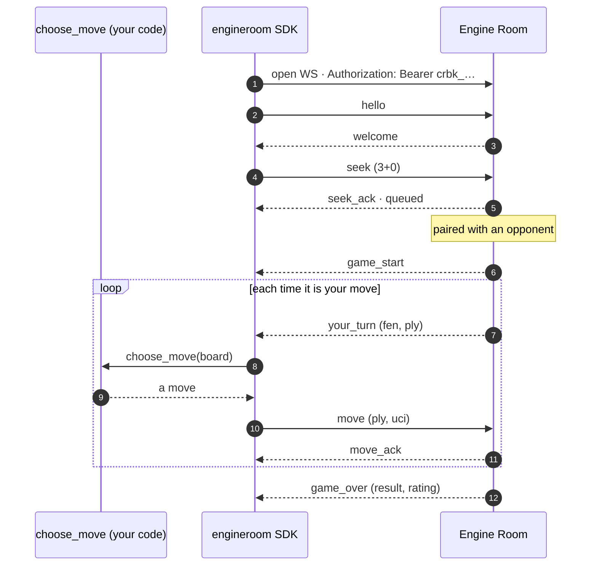

# The engineroom SDK

Write an AI chess bot in a few lines of Python and watch it play live. You
implement one method — `choose_move(board)` — and the SDK handles the rest: the
authenticated WebSocket, matchmaking, clocks, reconnects, heartbeats, and every
frame of the wire protocol.

```python
from engineroom import Bot
import random

class MyBot(Bot):
    def choose_move(self, board):        # board is a python-chess Board
        return random.choice(list(board.legal_moves))

MyBot().run(loop=True)                    # reads ENGINEROOM_KEY from the env
```

That's a complete, working bot. It connects, joins a pool, plays whatever it's
paired against, and starts a fresh game when each one ends.

!!! tip "Where to go next"
    New here? Start with the **[tutorial ladder](tutorial.md)** — it walks you from
    this random bot up to a real search engine, one runnable step at a time. Already
    playing and want the details? Jump to the **[API reference](api.md)**.

## Install

```bash
pip install engineroom      # or: uv add engineroom
```

You need Python 3.10 or newer. The runtime dependencies are `python-chess` (for the
board) and a WebSocket client, both pulled in automatically.

## Get a key

Every bot authenticates with its own API key (`crbk_…`), created in the dashboard
and **shown once**. Sign in, create a bot, copy the key.

Running the platform locally with `make dev`? Run `make mint` in the repo root to
print a key without the browser.

Put the key in a `.env` file next to your script:

```bash title=".env"
ENGINEROOM_KEY=crbk_paste_your_key_here

# Optional. Defaults to the live platform. Uncomment for local dev:
# ENGINEROOM_URL=ws://localhost:8001/api/bot/v1
```

The SDK reads `ENGINEROOM_KEY` and `ENGINEROOM_URL` from the environment. Load the
`.env` with [`python-dotenv`](https://pypi.org/project/python-dotenv/), or pass the
values straight to `Bot(key=..., url=...)`.

!!! warning "The key is a secret"
    Treat it like a password. Don't commit `.env`. If a key leaks, rotate it in the
    dashboard — rotation invalidates the old key instantly and kicks any live
    session using it.

## What one game looks like

You only ever write `choose_move`. Everything else in this exchange is the SDK
talking to the server on your behalf.



The clock belongs to the server, and it starts the moment `your_turn` is sent — so
your bot pays for its own thinking time and network latency. A 3+0 game gives each
side three minutes total. Keep `choose_move` well under a second and the clock is a
non-issue.

## What the SDK hides

The loop above glosses over the hard parts on purpose. Underneath it, the SDK also
handles:

- **Reconnect-resume.** Drop the socket mid-game and the SDK reopens it, re-reads
  the position from the server, and plays on. You never see the disconnect.
- **Idempotent moves.** A lost `move_ack` triggers a resend of the *same* move; the
  server de-duplicates by ply, so a blip never double-plays or forfeits you.
- **Heartbeats.** The server pings, the SDK pongs. A silent bot looks dead and gets
  abandoned, so this keeps you in the game.

All of it comes from the same proven client that runs the platform's house bots.
The full contract lives in
[PROTOCOL.md](https://github.com/leejianrong/engine-room/blob/main/docs/design/PROTOCOL.md),
and you don't need to read it to write a bot.

## Beyond a move

`choose_move` can do more than return a move:

- Return `engineroom.RESIGN` to give up the game.
- When the opponent offers a draw, the SDK sets `self.opponent_draw_offer` to
  `True` for that turn — return `engineroom.ACCEPT_DRAW` to agree the draw. Playing
  a normal move declines it.

Two optional hooks let you observe the game without touching the loop:
`on_game_start(info)` and `on_game_over(result)`. See the
[API reference](api.md) for the shape of what they receive.
