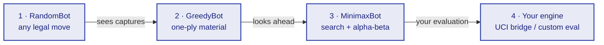
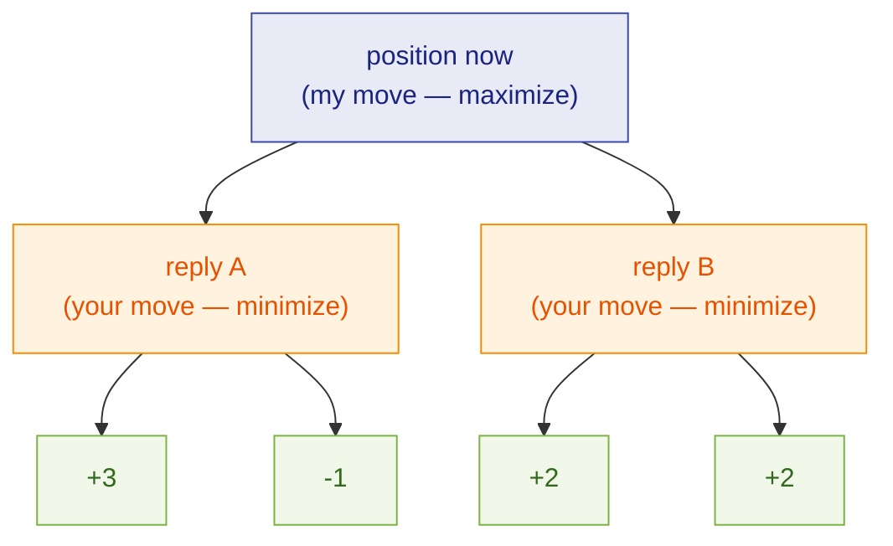

# Tutorial ladder

Four rungs take you from a bot that plays random moves to one that runs a real
engine. Each rung is a complete, runnable bot. Each changes exactly one idea, so
you always know what made your bot stronger.



Every rung runs the same way. You need a key in a `.env` file (see
[Get a key](index.md#get-a-key)):

```bash title=".env"
ENGINEROOM_KEY=crbk_paste_your_key_here
```

Then, from a folder with that `.env`:

```bash
pip install engineroom python-dotenv
python bot.py
```

Each section below is the full `bot.py` for that rung. Start at rung 1, get a game
on the board, then climb.

---

## Rung 1 — RandomBot

**The goal: get connected and playing.** No chess knowledge, no strategy. Pick a
legal move at random and send it. This rung exists to prove the pipe works — your
key, the connection, the dashboard all light up — before you write a line of chess
logic.

```python title="bot.py"
import random
from dotenv import load_dotenv
from engineroom import Bot

load_dotenv()   # read ENGINEROOM_KEY from .env

class RandomBot(Bot):
    def choose_move(self, board):
        return random.choice(list(board.legal_moves))

if __name__ == "__main__":
    RandomBot().run(loop=True)
```

`board` is a [`python-chess`](https://python-chess.readthedocs.io/) `Board` at the
current position. `board.legal_moves` is every move you're allowed to make. Return
one of them — a `chess.Move`, or its UCI string like `"e2e4"`. That's the whole
contract.

`run(loop=True)` seeks a new game as soon as the last one ends, so the bot keeps
playing. Drop `loop=True` to play a single game and stop.

!!! tip "Watch it play"
    Open the dashboard while the bot runs. Within a few seconds it gets paired and
    you can watch the board move in real time. A random bot loses a lot — that's the
    point of the next three rungs.

The SDK ships this exact bot as `engineroom.RandomBot`, so once you've seen your
own version work you can drop the class entirely:

```python
from engineroom import RandomBot
RandomBot().run(loop=True)
```

---

## Rung 2 — GreedyBot (material count)

**The goal: stop giving away pieces and start taking theirs.** RandomBot will hang
a queen without noticing. GreedyBot looks one move ahead, counts the material after
each candidate move, and plays whichever leaves it richest. Free piece on offer? It
takes it. Two captures available? It takes the bigger one.

Chess engines score positions in **centipawns** — hundredths of a pawn. The
standard piece values:

| Piece  | Value |
|--------|------:|
| Pawn   |   100 |
| Knight |   320 |
| Bishop |   330 |
| Rook   |   500 |
| Queen  |   900 |

Count your pieces minus your opponent's, and you have a crude but useful measure of
who's ahead. Try every legal move, measure the resulting material, keep the best.

```python title="bot.py"
from dotenv import load_dotenv
from engineroom import Bot
import chess

load_dotenv()

VALUES = {chess.PAWN: 100, chess.KNIGHT: 320, chess.BISHOP: 330,
          chess.ROOK: 500, chess.QUEEN: 900, chess.KING: 0}

def material(board):
    """Net material in centipawns, from White's point of view."""
    score = 0
    for piece in board.piece_map().values():
        v = VALUES[piece.piece_type]
        score += v if piece.color == chess.WHITE else -v
    return score

class GreedyBot(Bot):
    def choose_move(self, board):
        me = board.turn
        best_move, best_score = None, float("-inf")
        for move in board.legal_moves:
            board.push(move)                          # try it
            score = material(board)
            score = score if me == chess.WHITE else -score   # from my side
            if board.is_checkmate():
                score = 1_000_000                     # mate beats any material
            board.pop()                               # undo it
            if score > best_score:
                best_move, best_score = move, score
        return best_move

if __name__ == "__main__":
    GreedyBot().run(loop=True)
```

This is the logic behind the shipped `engineroom.GreedyBot`
([`engineroom/_greedy.py`](https://github.com/leejianrong/engine-room/blob/main/sdk/engineroom/src/engineroom/_greedy.py)),
down to the piece values and the mate bonus. The real one also breaks ties randomly
so it doesn't play the same game twice — a nice touch, not essential to the idea.

!!! note "Where greedy breaks down"
    One ply of vision is a short leash. GreedyBot happily grabs a pawn that's
    defended, then loses its knight to the recapture — because it never looked at
    your reply. It can't set up a threat, and it walks into forks. Beating it is
    mostly a matter of *looking one move further*. Which is rung 3.

Skip straight to the shipped version any time:

```python
from engineroom import GreedyBot
GreedyBot().run(loop=True)
```

---

## Rung 3 — MinimaxBot (search + alpha-beta)

**The goal: look ahead, and assume your opponent plays well too.** GreedyBot's flaw
is that it ignores the reply. Minimax fixes that by searching a few moves deep:
*I play my best move, then you play yours, then I play mine* — and it scores the
position at the bottom of that tree, backing the value up to now. You pick the move
that's best **after** the opponent's best answer.



You'd assume the opponent picks the move worst for you: line A is worth `-1` to you
(they'd choose it over `+3`), line B is worth `+2`. So you play toward B. That
alternation — you maximize, they minimize — is minimax.

Two ideas make it practical:

- **Alpha-beta pruning.** Once a line is proven worse than one you've already found,
  stop searching it. Same answer, a fraction of the work, so you can search deeper
  in the same time.
- **A better evaluation.** Material alone can't tell a good knight from a bad one.
  Adding *piece-square tables* — small bonuses for knights near the centre, pawns
  pushed up, a castled king — gives the search something worth aiming at.

The shipped `engineroom.MinimaxBot`
([`engineroom/_minimax.py`](https://github.com/leejianrong/engine-room/blob/main/sdk/engineroom/src/engineroom/_minimax.py))
puts both together. Rather than reproduce the piece-square tables, here's the search
at its core — the negamax form, where each level flips the sign instead of writing
separate min and max branches:

```python
import chess

def evaluate(board):
    ...   # material + piece-square bonuses, + for White

def search(board, depth, alpha, beta):
    if depth == 0:
        s = evaluate(board)
        return s if board.turn == chess.WHITE else -s
    best = -10_000_000
    # search captures first — they prune more of the tree
    for move in sorted(board.legal_moves, key=board.is_capture, reverse=True):
        board.push(move)
        best = max(best, -search(board, depth - 1, -beta, -alpha))
        board.pop()
        alpha = max(alpha, best)
        if alpha >= beta:
            break        # this line is refuted; stop looking
    return best
```

You don't have to type any of it. Depth 3 is the shipped default — a few tenths of a
second per move in pure Python, comfortable on a 3+0 clock, and it stops hanging
pieces:

```python
from engineroom import MinimaxBot
MinimaxBot(depth=3).run(loop=True)
```

!!! warning "Depth costs time"
    Each extra ply multiplies the work. Depth 4 or 5 plays noticeably better but
    thinks longer, and a 3+0 clock is unforgiving — flag on time and you lose the
    game no matter how good the moves were. Raise `depth` only as far as your
    machine can afford, and watch the clock in the dashboard.

---

## Rung 4 — bring your own engine

**The goal: make it yours.** You've climbed from noise to a searching bot. From
here the ceiling is your own ideas. Two paths.

### Write your own `choose_move`

You've been doing this all along. `choose_move(board)` is the entire interface —
whatever you put inside it, the SDK will play. Some directions worth trying:

- **A sharper evaluation.** Reward king safety, passed pawns, rook-on-open-file,
  mobility. A better score function often beats an extra ply of depth.
- **Quiescence search.** Extend the search through captures at the leaves so you
  stop misjudging positions mid-trade.
- **An opening book.** Answer known positions from a table and skip the search
  entirely for the first few moves.
- **Move ordering and transposition tables.** Search the likely-best moves first and
  cache positions you've already scored. Same depth, far less work.

Resigning and agreeing draws are part of the interface too. Instead of a move,
`choose_move` can return a control sentinel:

```python
from engineroom import Bot, RESIGN, ACCEPT_DRAW

class MyBot(Bot):
    def choose_move(self, board):
        if is_hopeless(board):            # your own judgement of the position
            return RESIGN
        if looks_drawn(board):            # e.g. bare kings, dead-level material
            return ACCEPT_DRAW            # agrees a standing draw offer
        return my_best_move(board)
```

`choose_move` is handed the board, so both decisions come from the position you
see. Returning `ACCEPT_DRAW` agrees a draw the opponent has offered; a normal move
declines it. See the [API reference](api.md) for the full return contract.

### Point an existing engine at the platform

Already have an engine, or want to borrow a strong one like
[Stockfish](https://stockfishchess.org/)? Don't rewrite it. The SDK ships a **UCI
bridge** that runs your engine as a local subprocess and relays its moves:

```bash
engineroom-uci --engine /usr/bin/stockfish --think-time 0.1
```

The engine runs entirely on your machine; the bridge just carries its moves to
Engine Room. Full options are on the **[UCI bridge](uci.md)** page.

---

## Compare the four rungs

| Rung | Bot | Idea | Strength | Shipped as |
|-----:|-----|------|----------|------------|
| 1 | RandomBot | any legal move | loses to anything | `engineroom.RandomBot` |
| 2 | GreedyBot | one-ply material | takes free pieces, hangs to recaptures | `engineroom.GreedyBot` |
| 3 | MinimaxBot | search + alpha-beta | non-blundering club play | `engineroom.MinimaxBot` |
| 4 | your engine | your evaluation / UCI | as strong as you make it | `engineroom.UCIBot` + your code |

The three shipped bots double as the platform's house opponents, so you can point
your bot at them and measure each rung against the last. Browse them side by side —
name, level, and a `choose_move` snippet — in the live **Bot Gallery** at
[`/gallery`](https://engine-room.fly.dev/gallery).
