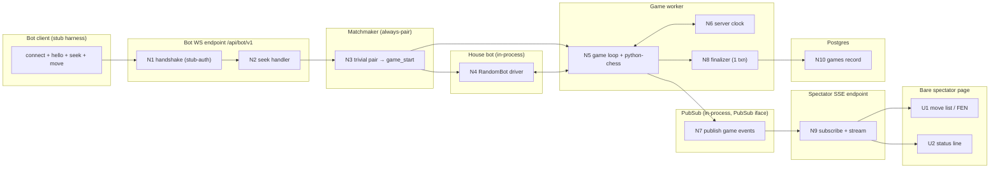

# Engine Room MVP — Shaping

Working document. Frame: [frame.md](frame.md). Ground truth for decisions remains the ADRs + [PROTOCOL.md](../design/PROTOCOL.md); this doc plans **how we build the already-decided design**, i.e. the slicing strategy and order.

The solution *architecture* is fixed (25 ADRs). The open decision here is the **slicing strategy**: how to cut the MVP into vertical, demoable increments and in what order. Shapes A/B/C below are competing slicing strategies, not competing architectures.

---

## Requirements (R)

These are constraints on the **build/slicing plan**, distilled from the frame and PRD. (Product requirements live in the PRD's 76 user stories; these discriminate between slicing strategies.)

| ID | Requirement | Status |
|----|-------------|--------|
| R0 | Reach the demoable slice: sign in → create bot (key once) → run quickstart → matched vs house bot → full 3+0 game to a real result, live on the dashboard, PGN saved | Core goal |
| R1 | Every increment ends in something observable/demoable — vertical slices, not horizontal layers | Must-have |
| R2 | Prove the riskiest mechanics early — the real-time spine (WebSocket + server-authoritative clock + `python-chess` legality + atomic finalization) is exercised in the first playable slice, not deferred to final integration | Must-have |
| R3 | The hero path (SDK / quickstart / `RandomBot`) is prioritized ahead of secondary polish (UCI bridge, lobby SSE, dashboard chrome) | Must-have |
| R4 | The bot-WebSocket test seam (PRD Testing Decisions, Option A) is exercisable from the first playable slice onward | Must-have |
| R5 | Stay inside the MVP scope boundary — single-process, no Redis, Blitz only; no deferred items pulled forward | Must-have |
| R6 | Build behind the seam interfaces (`MatchmakingQueue`, `PubSub`) so multi-worker scale-out is not precluded | Must-have |
| R7 | The game is watchable live (SSE spectating) within the demoable slice — not a post-MVP add-on | Must-have |

---

## CURRENT: greenfield

Nothing is built. The repo contains design docs only (REQS, CONTEXT, ADRs, PROTOCOL, PRD). No baseline system to map — so CURRENT is empty and every shape below is net-new construction. The only "existing seams" are the *contracts* already written (PROTOCOL.md, the ADR interfaces), which every shape must conform to.

---

## Slicing strategies (shapes)

### A: Walking skeleton, then thicken

Cut the thinnest possible **end-to-end thread** first — one bot connects over the real WebSocket, is trivially paired with a house bot, plays a real (short) `python-chess` game under the real server clock, finalizes to Postgres, and shows on a bare SSE view. Everything is real but minimal (stub auth, always-pair matcher, one time control, no UI chrome). Then each later slice **thickens one dimension**: real GitHub OAuth + bot CRUD/keys, real Elo matchmaking + same-owner exclusion + TTL, reconnect/idempotency, resign/draw + auto-draws, the polished dashboard + lobby, and finally the UCI bridge.

| Part | Mechanism | Flag |
|------|-----------|:----:|
| **A1** | **Skeleton thread** — WS endpoint accepts a (stub-auth) bot; `hello`/`welcome`; always-pair matcher pairs it with an in-process house `RandomBot`; real `python-chess` board + server clock drive the `your_turn`/`move` loop for 3+0; `game_over` finalizes result+PGN+rating to Postgres in one txn; bare SSE endpoint streams the moves | |
| **A2** | **Real identity** — GitHub OAuth (FastAPI-Users), bot CRUD, hashed rotatable API key shown once; WS handshake authenticates the real key + protocol version; newest-wins | |
| **A3** | **Real matchmaking** — replace always-pair with Elo pools per time control behind `MatchmakingQueue`; same-owner exclusion (house exempt), seek TTL/expiry, anti-rematch cooldown, ≥2-to-pair; start-grace → ABORTED | |
| **A4** | **Resilience** — reconnect resume via `welcome.active_game`; `ply`-idempotency (dup re-ack, stale ignore, future→`INVALID_PLY`); heartbeat mutual-abandonment→ABORTED; illegal-move forfeit; rate limits + soft cooldowns | |
| **A5** | **Full chess outcomes** — resign, draw offer/accept (piggyback + standalone), server auto-draws (stalemate/insufficient/threefold/fifty-move); full termination vocabulary + Elo update on FINISHED only | |
| **A6** | **Spectator UX** — Svelte dashboard: active-games lobby (REST poll), live board via SSE with catch-up snapshot + replay from move 1, both bots' name+rating/clock/side-to-move | |
| **A7** | **Hero onboarding + UCI bridge** — `engineroom` SDK repo (subclass `Bot`, `choose_move`), `uv`+`pyproject.toml` quickstart template, client-side UCI bridge; reference bots double as house bots | |

### B: Layer-by-layer (horizontal)

Build each subsystem to completion before the next: full auth + bot CRUD, then full matchmaking, then the full game engine, then full spectating, then the SDK. Each layer is "done" (all its user stories) before the next starts.

| Part | Mechanism | Flag |
|------|-----------|:----:|
| **B1** | **Auth & identity layer** — GitHub OAuth, bot CRUD, key hashing/rotation, all of it, no gameplay yet | |
| **B2** | **Matchmaking layer** — Elo pools, seek/TTL/cooldown/same-owner, tickets → PAIRED, with no game loop to feed | ⚠️ |
| **B3** | **Game engine layer** — full WS protocol, clock, rules, reconnect, draws, finalization, all at once | ⚠️ |
| **B4** | **Spectating layer** — SSE + dashboard + lobby, fed by the completed engine | |
| **B5** | **SDK layer** — `engineroom` SDK + quickstart + UCI bridge against the finished server | |

### C: Onboarding-funnel-first (vertical, user-journey order)

Slice in the order the *user* experiences the product, each slice demoable end-to-end: first identity (sign in, make a bot, see the key), then connect-and-play vs a house bot, then watch it live, then polish. Vertical like A, but ordered by the funnel rather than by technical risk.

| Part | Mechanism | Flag |
|------|-----------|:----:|
| **C1** | **Identity slice** — GitHub OAuth + bot CRUD + key-once; demo: sign in, create a bot, copy its key (no gameplay) | |
| **C2** | **Play slice** — authenticated WS + seek + always-pair vs house bot + real clock/rules + finalization; demo: run `RandomBot`, watch a full game complete in logs/DB | |
| **C3** | **Watch slice** — SSE + dashboard + lobby + replay; demo: spectate the live game in a browser | |
| **C4** | **Real matchmaking slice** — Elo pools, TTL, same-owner exclusion, cooldown replacing always-pair | |
| **C5** | **Resilience + outcomes slice** — reconnect/idempotency, heartbeat abort, resign/draw/auto-draw, rate limits | |
| **C6** | **Hero polish slice** — packaged SDK repo + quickstart template + UCI bridge | |

---

## Fit Check

| Req | Requirement | Status | A | B | C |
|-----|-------------|--------|---|---|---|
| R0 | Reach the demoable slice: sign in → create bot (key once) → run quickstart → matched vs house bot → full 3+0 game to a real result, live on the dashboard, PGN saved | Core goal | ✅ | ✅ | ✅ |
| R1 | Every increment ends in something observable/demoable — vertical slices, not horizontal layers | Must-have | ✅ | ❌ | ✅ |
| R2 | Prove the riskiest mechanics early — the real-time spine is exercised in the first playable slice, not deferred | Must-have | ✅ | ❌ | ❌ |
| R3 | The hero path (SDK / quickstart / `RandomBot`) is prioritized ahead of secondary polish | Must-have | ✅ | ❌ | ✅ |
| R4 | The bot-WebSocket test seam is exercisable from the first playable slice onward | Must-have | ✅ | ❌ | ❌ |
| R5 | Stay inside the MVP scope boundary — single-process, no Redis, Blitz only | Must-have | ✅ | ✅ | ✅ |
| R6 | Build behind the seam interfaces so multi-worker scale-out is not precluded | Must-have | ✅ | ✅ | ✅ |
| R7 | The game is watchable live (SSE spectating) within the demoable slice | Must-have | ✅ | ✅ | ✅ |

**Notes:**
- **B fails R1:** the matchmaking and engine layers (B2, B3) have no demoable output until later layers exist — B2 pairs tickets with no game to start; B3 is a huge all-at-once integration. Horizontal layers, not slices.
- **B fails R2, R4:** the real-time spine lands as one monolithic B3 late in the sequence, so the riskiest mechanics and the WS test seam arrive last — the opposite of de-risking early. (B2/B3 flagged ⚠️: "build a subsystem with nothing to exercise it" is under-specified.)
- **B fails R3:** the SDK/hero path is the final layer (B5), after everything else.
- **C fails R2, R4:** C leads with the identity slice (C1) and doesn't reach a playable game / the WS seam until C2 (second slice). The spine is proven one slice later than in A. C is otherwise strong and vertical.
- A, B, C all satisfy R0/R5/R6/R7 — the destination, scope boundary, seam interfaces, and live-spectating are common to all three; they differ only in slice shape and order.

---

## Decision

🟡 **Shape A (walking skeleton, then thicken) is SELECTED** (decided 2026-07-07). It is the only shape passing all of R0–R7: it proves the real-time spine + WS test seam in slice 1 (R2/R4), keeps every slice demoable (R1), and A7 keeps the hero SDK path as a first-class slice (R3).

Rejected:
- **C** — close, fully-vertical runner-up; misses only R2/R4 (spine proven in slice 2, not slice 1). Preferred only if "follow the user's journey" outranks "de-risk the hardest thing first."
- **B** — dominated; horizontal layering fails the vertical-slice and de-risking requirements.

**Next step:** breadboard Shape A (detail A1 first — the skeleton thread), then slice A1–A7 into the Slices doc. A's parts A1…A7 are already ordered to become the vertical slices V1…V7.

---

## Detail A: breadboard

Breadboarding produced inline (the `/breadboarding` skill is not installed). Tables are the source of truth; the Mermaid diagram renders them. Detailed here for **A1 (the skeleton thread → V1)**; A2–A7 thicken these same affordances and are breadboarded per-slice in the Slices doc.

### A1 — Skeleton thread (→ V1)

**Goal of the demo:** a stub-auth bot client connects, seeks 3+0, is auto-paired with an in-process house `RandomBot`, plays a full real `python-chess` game under the real server clock, and the moves appear live on a bare web page; on game end the result + PGN + rating land in Postgres. Everything real, everything minimal.

**Deliberately stubbed in A1 (real in later slices):** auth is a fixed dev token, not GitHub OAuth + hashed keys (A2); the matcher always-pairs vs house, no Elo/pool/TTL (A3); no reconnect/idempotency/heartbeat (A4); no resign/draw/auto-draw beyond checkmate/stalemate/timeout the engine reports (A5); the spectator page is unstyled and has no lobby (A6); the client is a test harness, not the packaged SDK (A7).

#### UI Affordances

| ID | Place | Affordance | Wires Out |
|----|-------|------------|-----------|
| U1 | Bare spectator page | Move list / FEN text that appends each move as it streams | subscribes to N9 (SSE stream) |
| U2 | Bare spectator page | "Connected / game over" status line reflecting stream lifecycle | reads N9 |

#### Non-UI Affordances

| ID | Place | Affordance | Wires Out |
|----|-------|------------|-----------|
| N1 | Bot WS endpoint `/api/bot/v1` | Handshake handler: accept WS, **stub-auth** (fixed dev token), `hello`→`welcome` | → N2 |
| N2 | Bot WS endpoint | Seek handler: accept `seek {3+0}`, `seek_ack`, hand ticket to matcher | → N3 |
| N3 | Matchmaker (always-pair) | Trivial matcher: pair the seeking bot with N4; create `Game` in PAIRED, emit `game_start` | → N4, → N5 |
| N4 | House bot (in-process) | `RandomBot` driver: on `your_turn`, pick a uniformly-random legal move, send `move` | → N5 |
| N5 | Game worker | Game loop + `python-chess` board: send `your_turn` (full FEN + clocks), receive `move`, validate legality, apply, advance `ply`, detect terminal (mate/stalemate/timeout) | → N6, → N7, → N8 |
| N6 | Game worker | Server clock: per-seat remaining ms; runs from `your_turn`-send to `move`-receive; flags at 0 → timeout loss | → N5 |
| N7 | PubSub (in-process, behind `PubSub` iface) | Publish game events (move applied, game_over) to a per-game channel | → N9 |
| N8 | Finalizer | On terminal: render PGN + compute result/termination; write records in **one Postgres txn** (rating update stubbed constant in A1, real Elo in A5) | → N10 |
| N9 | Spectator SSE endpoint | Subscribe to N7's channel; stream events (no catch-up snapshot yet — that's A6) | → U1, U2 |
| N10 | Postgres | Durable records: minimal `games` row (result, termination, PGN, FEN) | — |

**Seam-interface note (R6):** N3's queue sits behind the `MatchmakingQueue` interface and N7 behind `PubSub`, even though both are trivial/in-process in A1 — so A3 (real matchmaking) and future Redis scale-out swap the implementation without touching N2/N5/N9 call sites.

**Test-seam note (R4):** the A1 demo is driven by a fake protocol client speaking N1/N2/N5's wire messages — this *is* the PRD's primary WS test seam, available from V1 onward.

#### Wiring diagram (renders the tables above)

### A2–A7 — thickening (breadboarded per-slice in the Slices doc)

Each later part replaces or extends specific A1 affordances rather than adding new subsystems:

| Part | Thickens | Replaces/extends |
|------|----------|------------------|
| A2 | Real identity | N1 stub-auth → GitHub OAuth + hashed rotatable key at handshake; adds REST bot-CRUD place + newest-wins session |
| A3 | Real matchmaking | N3 always-pair → Elo pools behind `MatchmakingQueue`, same-owner exclusion (house exempt), seek TTL/expiry, anti-rematch, start-grace→ABORTED |
| A4 | Resilience | N1/N5 gain reconnect-resume (`welcome.active_game`), `ply`-idempotency, heartbeat mutual-abandon→ABORTED, illegal-move forfeit, rate limits |
| A5 | Full outcomes | N5/N8 gain resign, draw offer/accept, server auto-draws, full termination vocab, real Elo update (N8 rating no longer stubbed) |
| A6 | Spectator UX | N9 gains catch-up snapshot + replay; U1/U2 SvelteKit view (stood up in V1, D-b) **extended** with a real board + REST-poll lobby |
| A7 | Hero onboarding | Bot client stub → packaged `engineroom` SDK repo + `uv` quickstart + client-side UCI bridge; reference bots become the N4 house bots |
